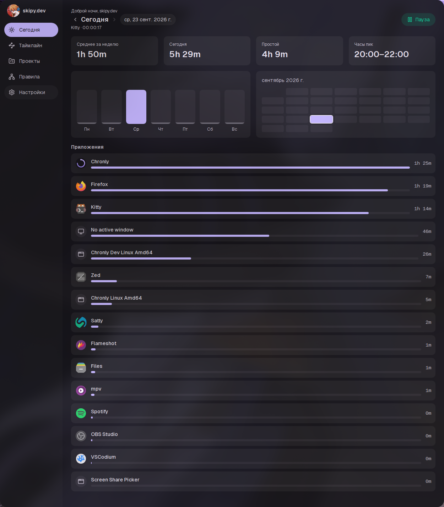

```
        __                     __     
  _____/ /_  _________  ____  / /_  __
 / ___/ __ \/ ___/ __ \/ __ \/ / / / /
/ /__/ / / / /  / /_/ / / / / / /_/ / 
\___/_/ /_/_/   \____/_/ /_/_/\__, /  
                             /____/   
```

My own time tracker. I got tired of manually starting/stopping timers and
never trusting the numbers, so I built something that just runs in the
background on my machine, watches which window I'm actually in, and figures
out on its own what project/task that time belongs to.



## Why

I need three things at once: where my time actually goes day to day, an
estimate-vs-actual view per project/task for freelance work, and a signal for
how much of my "work" time is actually AFK/context-switching. Everything
stays local — SQLite on disk, no cloud sync, no account.

## Features

- **Automatic tracking.** Watches the focused window on Hyprland and records
  activity blocks as you work, splitting them on an AFK threshold you control.
- **Today dashboard.** Weekly average, today's total, idle time, auto-detected
  peak hours, a Mon–Sun bar chart, a GitHub-style month heatmap, and a
  per-app time breakdown — navigate to any past day from the same screen.
- **Per-app detail view.** Click any app on Today to see its own weekly
  average, trend vs. yesterday, and an hourly usage chart showing what time
  of day you actually use it.
- **Timeline.** Every tracked activity for a day, either chronologically or
  grouped by app with "last active" recency. Reassign any block to a project
  (or a project with no specific task) right from the list.
- **Projects & tasks.** Track estimate vs. actual time per project, create,
  edit, and archive projects and tasks.
- **Assignment rules.** A pannable, zoomable node graph connects app-name
  patterns to projects, so new activity gets auto-assigned instead of piling
  up unsorted.
- **System tray.** Pause/resume tracking and jump between recent tasks without
  opening the window.
- **Live theming.** Reads a [matugen](https://github.com/InioX/matugen)-generated
  palette and re-themes the whole UI instantly when your wallpaper changes,
  with a built-in fallback palette when matugen isn't set up, and a manual
  accent-color override if you'd rather pick your own.
- **Real app icons.** Resolves each app's actual icon from your system's
  `.desktop` files and icon theme (including your own user-local icons), not
  a generic placeholder.
- **Personalization.** Name, avatar, interface scale, and a full English/
  Russian translation, all in Settings — plus a first-run onboarding tour.
- **Configurable navigation.** Sidebar, top tabs, or a Ctrl/Cmd+K command
  palette — pick whichever fits how you work.
- **Developer mode.** Hidden behind a press-and-hold unlock in Settings —
  DB path, app version, and a live log viewer once unlocked.

## Requirements

- Linux with **Hyprland** (window tracking talks to Hyprland's own IPC socket
  directly, not the generic `wlr-foreign-toplevel-management` protocol — so
  Hyprland only, for now)
- `webkit2gtk-4.1` — on Arch/CachyOS this means building and running with the
  `webkit2_41` Go build tag (see below); Wails v2 looks for `webkit2gtk-4.0`
  by default and fails at the pkg-config step otherwise
- Go 1.25+
- Node.js + npm
- [Wails v2](https://wails.io) CLI (`go install github.com/wailsapp/wails/v2/cmd/wails@latest`)

## Development

```bash
wails dev -tags webkit2_41
```

Runs the app with hot reload for both the Go backend and the Vite/React frontend.

## Building

```bash
wails build -tags webkit2_41
```

Produces a binary in `build/bin/`.

## Verifying changes

```bash
go build -tags webkit2_41 ./... && go vet -tags webkit2_41 ./... && go test -tags webkit2_41 ./... -count=1
cd frontend && npx tsc --noEmit -p tsconfig.json && npm run build
```

## Tech stack

- **Backend:** Go, split into `backend/tracker` (pure domain logic, OS deps
  isolated to platform-tagged files) and `backend/storage` (SQLite). Uses
  [Wails v2](https://wails.io) for the desktop shell.
- **SQLite via `modernc.org/sqlite`** — pure Go driver, no CGO, so
  cross-compiling later stays simple.
- **Tray via [energye/systray](https://github.com/energye/systray)** — also
  pure Go, talks the StatusNotifierItem/DBusMenu D-Bus protocols directly
  instead of going through GTK. That matters because Wails' own webview
  already runs a GTK main loop on Linux, and a second, independent one (as
  `github.com/getlantern/systray` uses via libappindicator) reliably aborts
  the process — confirmed by hand before switching libraries.
- **Frontend:** React 19, TypeScript, Vite, Tailwind CSS v4, TanStack Query,
  Zustand, Framer Motion, `d3-force` (Rules graph), `@tanstack/react-virtual`
  (Timeline list)

## Data & configuration

- Database: `~/.config/chronly/chronly.db` (SQLite, WAL mode). Override with
  the `CHRONLY_DB_PATH` environment variable.
- Logs: `~/.config/chronly/chronly.log`, also viewable in Settings once
  developer mode is unlocked.
- Theme: reads `~/.config/colors/matugen/chronly.css`, written by matugen.

## License

Not yet decided.
